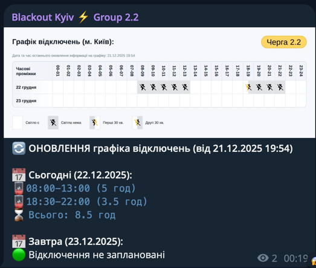

# Kyiv Power Outage Monitor Bot 🔌⚡

[](https://github.com/c-pher/DTEK_PowerOutage_Schedule/actions/workflows/run_bot.yml)



Telegram bot that monitors power outage schedules in Kyiv and automatically posts updates to a channel when the schedule
changes.

## Features

- 📊 Monitors power outage schedules for specific groups (1.1 to 6.2)
- 🔄 Automatically checks for updates every 15 minutes
- 📢 Posts notifications to Telegram channel only when changes are detected
- 💾 Stores previous state locally to detect changes
- 📅 Shows schedules for both today and tomorrow
- 🇺🇦 Ukrainian language interface

## Prerequisites

- Python 3.8 or higher
- Telegram account
- Telegram bot token (from @BotFather)
- A Telegram channel (where you are admin)

## Setup

### 1. Create a Telegram Bot

1. Open Telegram and search for [@BotFather](https://t.me/BotFather)
2. Send `/newbot` command
3. Follow instructions to create your bot
4. Copy the bot token (looks like: `123456789:ABCdefGHIjklMNOpqrsTUVwxyz`)

### 2. Create a Telegram Channel

1. Create a new channel in Telegram
2. Add your bot as an administrator with "Post Messages" permission
3. Get your channel ID:
    - If public channel: use `@channelname`
    - If private channel: forward a message from the channel to [@userinfobot](https://t.me/userinfobot) to get the ID (
      will be like `-1001234567890`)

### 3. Install Dependencies

```bash
# Install required packages
pip install -r requirements.txt
```

### 4. Configure the Bot

Set environment variables:

```bash
# Linux/macOS
export TELEGRAM_BOT_TOKEN='your_bot_token_here'
export TELEGRAM_CHANNEL_ID='@yourchannel'  # or -1001234567890
export GROUP_NUMBER='1.1'  # Your group number (1.1, 1.2, 2.1, ... 6.2)

# Windows (Command Prompt)
set TELEGRAM_BOT_TOKEN=your_bot_token_here
set TELEGRAM_CHANNEL_ID=@yourchannel
set GROUP_NUMBER=1.1

# Windows (PowerShell)
$env:TELEGRAM_BOT_TOKEN='your_bot_token_here'
$env:TELEGRAM_CHANNEL_ID='@yourchannel'
$env:GROUP_NUMBER='1.1'
```

### 5. Run the Bot

```bash
python power_outage_bot.py
```

## Available Groups

The bot supports monitoring any of these groups:

- 1.1, 1.2
- 2.1, 2.2
- 3.1, 3.2
- 4.1, 4.2
- 5.1, 5.2
- 6.1, 6.2

## Message Format

The bot sends messages in this format:

```
⚡ Графік відключень
📍 Черга 1.1
🕐 Оновлено: 06.11.2025 20:15

📅 Сьогодні (06.11.2025):
🔴 Відключення: 11:00-15:00, 21:00-24:00

📅 Завтра (07.11.2025):
🔴 Відключення: 09:00-12:00

Джерело: ДТЕК
```

When schedule changes:

```
🔄 ОНОВЛЕННЯ графіка відключень
📍 Черга 1.1
...
```

## Running as a Service

### Linux (systemd)

Create file `/etc/systemd/system/power-outage-bot.service`:

```ini
[Unit]
Description=Power Outage Monitor Bot
After=network.target

[Service]
Type=simple
User=your_user
WorkingDirectory=/path/to/bot
Environment="TELEGRAM_BOT_TOKEN=your_token"
Environment="TELEGRAM_CHANNEL_ID=@yourchannel"
Environment="GROUP_NUMBER=1.1"
ExecStart=/usr/bin/python3 power_outage_bot.py
Restart=always
RestartSec=10

[Install]
WantedBy=multi-user.target
```

Enable and start:

```bash
sudo systemctl daemon-reload
sudo systemctl enable power-outage-bot
sudo systemctl start power-outage-bot
sudo systemctl status power-outage-bot
```

### Docker

Create `Dockerfile`:

```dockerfile
FROM python:3.11-slim

WORKDIR /app

COPY requirements.txt .
RUN pip install --no-cache-dir -r requirements.txt

COPY power_outage_bot.py .

ENV TELEGRAM_BOT_TOKEN=""
ENV TELEGRAM_CHANNEL_ID=""
ENV GROUP_NUMBER="1.1"

CMD ["python", "power_outage_bot.py"]
```

Build and run:

```bash
docker build -t power-outage-bot .

docker run -d \
  --name power-outage-bot \
  --restart unless-stopped \
  -e TELEGRAM_BOT_TOKEN='your_token' \
  -e TELEGRAM_CHANNEL_ID='@yourchannel' \
  -e GROUP_NUMBER='1.1' \
  -v $(pwd)/outage_state.json:/app/outage_state.json \
  power-outage-bot
```

### Windows (Task Scheduler)

Create a batch file `run_bot.bat`:

```batch
@echo off
set TELEGRAM_BOT_TOKEN=your_token
set TELEGRAM_CHANNEL_ID=@yourchannel
set GROUP_NUMBER=1.1
cd /d "C:\path\to\bot"
python power_outage_bot.py
```

Create a task in Task Scheduler:

1. Open Task Scheduler
2. Create Basic Task
3. Set trigger: "At startup" or "When I log on"
4. Action: Start a program
5. Program: `C:\path\to\run_bot.bat`

## State File

The bot stores its state in `outage_state.json`. This file contains:

- Previous schedule data
- Last check timestamp
- Last update timestamp

**Important:** Don't delete this file while the bot is running, as it's used to detect changes.

## Logs

The bot logs all activities to console. To save logs to a file:

```bash
# Linux/macOS
python power_outage_bot.py >> bot.log 2>&1

# Or use systemd as shown above for better log management
```

## Troubleshooting

### Bot doesn't send messages

1. Check bot token is correct
2. Verify bot is admin in the channel with "Post Messages" permission
3. Check channel ID format (@ for public, -100 prefix for private)

### "No data found for group"

- Verify your GROUP_NUMBER is correct (1.1, 1.2, etc.)
- Check if the data source is accessible

### Connection errors

- Check internet connection
- Verify GitHub is accessible
- Wait a few minutes and try again (may be temporary)

## Data Source

Data is fetched from: https://github.com/Baskerville42/outage-data-ua

Updates every ~15 minutes from ДТЕК (Ukrainian energy provider).

## License

Free to use and modify for personal and commercial purposes.

## Support

For issues or questions, create an issue in the repository.

---

Made with ❤️ for Ukraine 🇺🇦
